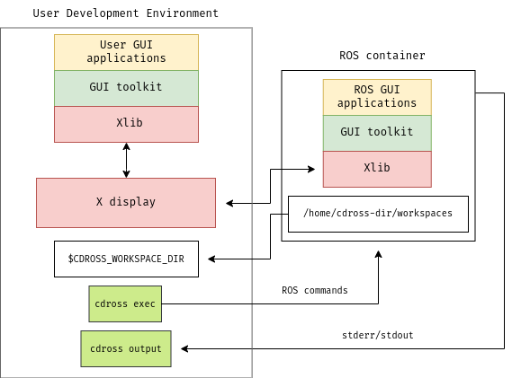

# [cdross (Container Driven ROS Setup)](https://github.com/Zoh-j02r/cdross)

#### Project goal

This project seeks the development of tools to increase productivity in ROS enviroment on containers, using from ROS official dockerhub images and scripting for automated building and sharing host resources. There are some advantages for using ROS this way such as:
- no need to use a compatible distribution.
- faster installation.
- no generation of cache files through the host system
- better main IDE control

